# Audio Amplifier

This amplifier project contains an audio power amplifier a preamplifier and
their power supplies.

## Repositories

- [Audio Power Amplifier](https://github.com/flavian112/audio_power_amplifier.git)
- [Audio Power Amplifier Power Supply](https://github.com/flavian112/audio_power_amplieier_power_supply.git)
- [Audio Preamplifier](https://github.com/flavian112/audio_preamplifier.git)
- [Audio Preamplifier Power Supply](https://github.com/flavian112/audio_preamplifier_power_supply.git)

## Datasheets

- [MJE15034 MJE15035 Power Transistor](./datasheets/on_semiconductor_mje15034_mje15035_npn_pnp_power_transistors.pdf)
- [MJL4281 MJL4302 Power Transistor](./datasheets/on_semiconductors_mjl4281_mjl4302_power_transistors.pdf)
- [BC546 Transistor](./datasheets/fairchild_bc546_bc547_bc548_bc549_bc550_npn_epitaxial_sillicon_transistor.pdf)
- [GPBC Full Bridge Rectifier](./datasheets/comchip_gbpc_glass_passivated_bridge_rectifier.pdf)
- [1N4001 Diode](./datasheets/vishay_1n4001_1n4002_1n4003_1n4004_1n4005_1n4006_1n4007_rectifier.pdf)
- [LM337 Adjustable Regulator](./datasheets/texas_instruments_lmx37_adjustable_regulator.pdf)
- [LM317 Adjustable Regulator](./datasheets/texas_instruments_lm317_adjustable_regulator.pdf)
- [LM4562 Audio Operational Amplifier](./datasheets/texas_instruments_lm4562_dual_operation_amplifier.pdf)
- [OPA2134 Audio Operational Amplifier](./datasheets/texas_instruments_opax134_audio_operational_amplifier.pdf)
- [WL-TMRC LED](./datasheets/würth_elektronik_wl-tmrc_tht_led.pdf)
- [3339 Trimming Potentiometer](./datasheets/bourns_3339_trimming_potentiometer.pdf)
- [PDB18 Potentiometer](./datasheets/bourns_pdb18_potentiometer.pdf)
- [PTV09 Potentiometer](./datasheets/bourns_ptv09_potentiometer.pdf)
- [FWXXA Power Resistor](./datasheets/bourns_fwxxa_power_resistors.pdf)
- [CW Wirewound Resistor](./datasheets/vishay_cw_wirewound_resistors.pdf)
- [HSE3 HSE6 Power Resistor](./datasheets/arcol_hse3_hse6_aluminium_housed_power_resistor.pdf)
- [MF MFS RK Metal Film Resistor](./datasheets/koa_speer_mf_mfs_rk_metal_film_resistors.pdf)
- [RSF Metal Oxide Resistor](./datasheets/yaego_rsf_metal_oxide_film_resistors.pdf)
- [MBA MBB MBE Metal Film Resistor](./datasheets/vishay_mba_mbb_mbe_metal_film_resistors.pdf)
- [ZLH Aluminium Electrolytic Capacitor](./datasheets/rubycon_zlh_aluminium_electrolytic_capacitors.pdf)
- [K Series Multilayer Ceramic Capacitor](./datasheets/vishay_k_series_multilayer_ceramic_capacitors.pdf)
- [FKP 02 PP Capacitor](./datasheets/wima_fkp_02_pp_capacitors.pdf)
- [MKS 4 PET Capacitor](./datasheets/wima_mks_4_pet_capacitors.pdf)
- [WCAP-ATLI Aluminium Electrolytic Capacitor](./datasheets/würth_elektronik_wcap-atli_aluminum_electrolytic_capacitors.pdf)
- [WCAP-FTXX Film Capacitor](./datasheets/würth_elektronik_wcap-ftxx_film_capacitors.pdf)
- [WS-DITV DIP Switch](./datasheets/würth_elektronik_ws-ditv_dip_switch.pdf)
- [RA1 Power Switch](./datasheets/eswitch_ra1_power_switch.pdf)
- [239 Series Fuse](./datasheets/littelfuse_239_series_fuse.pdf)
- [213 Series Fuse](./datasheets/littlefuse_213_series_fuse.pdf)
- [WR-FSH Fuseholder](./datasheets/würth_elektronik_panel_mount_fuseholder.pdf)
- [CQM Fuseholder](./datasheets/schurter_cqm_fuseholder.pdf)
- [RCA Jack](./datasheets/kobiconn_rca_jacks.pdf)
- [EAC309X Power Terminal](./datasheets/switchcraft_eac309x_power_terminal.pdf)
- [LK2NG Speaker Terminal](./datasheets/visaton_5189_5192_5183_5182_5195_speaker_terminal.pdf)

## References

- [Elliott Sound Products - Hi-Fi Power Amplifier](https://sound-au.com/project3a.htm)
- [Elliott Sound Products - Hi-Fi Preamplifier](https://sound-au.com/project97.htm)

## Files

### Power Amplifier

#### Schematic

#### Board

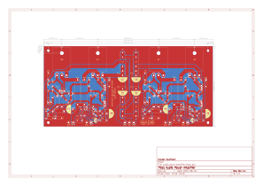

#### 3D View

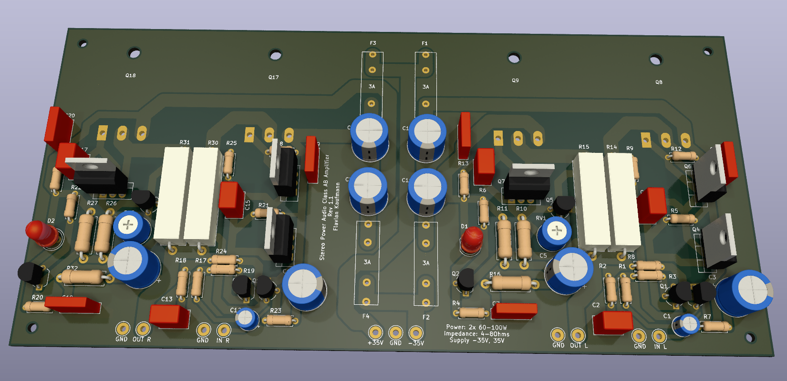

### Power Amplifier Power Supply

#### Schematic

#### Board

#### 3D View

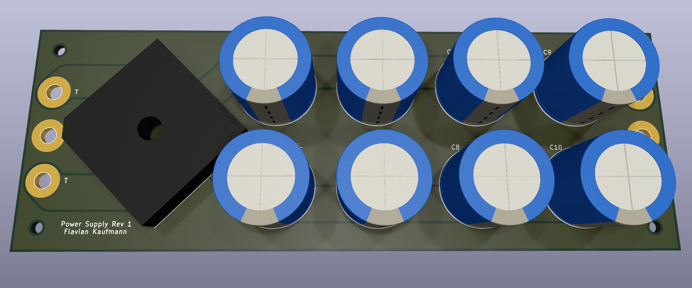

### Preamplifier

#### Schematic

#### Board

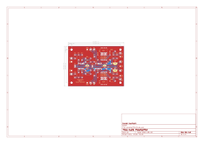

#### 3D View

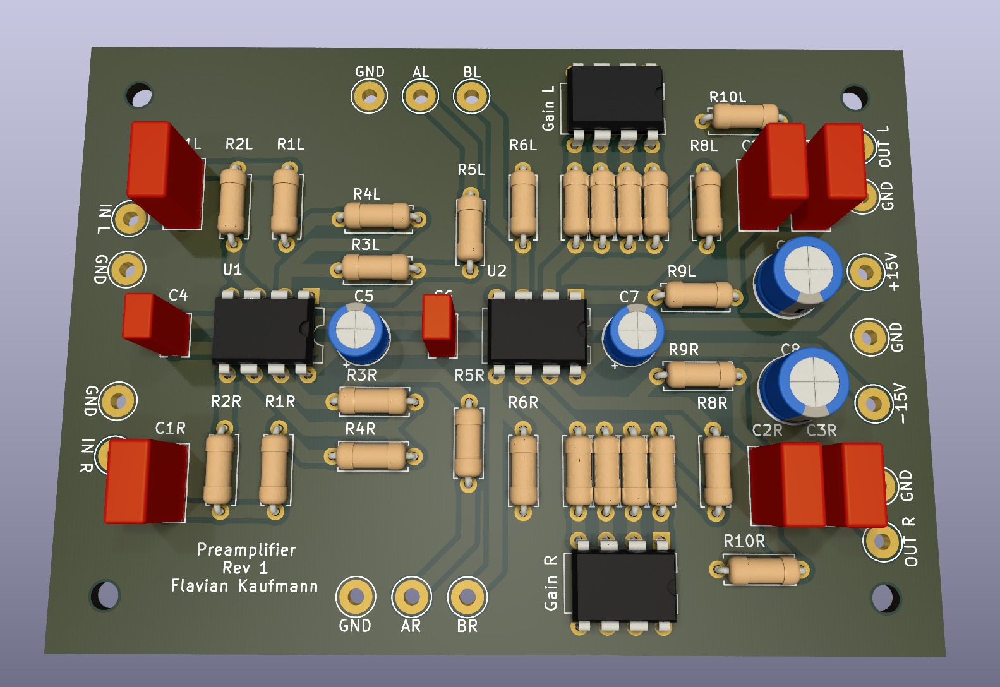

### Preamplifier Power Supply

#### Schematic

#### Board

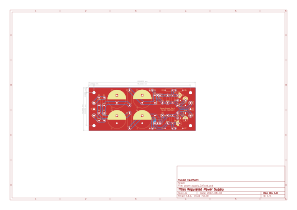

#### 3D View

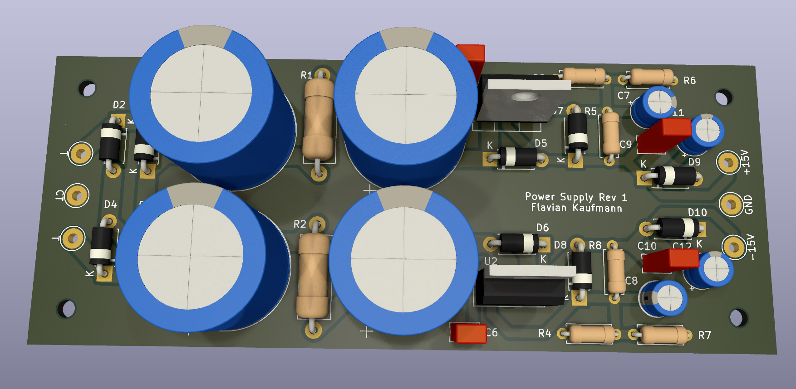

## Photos

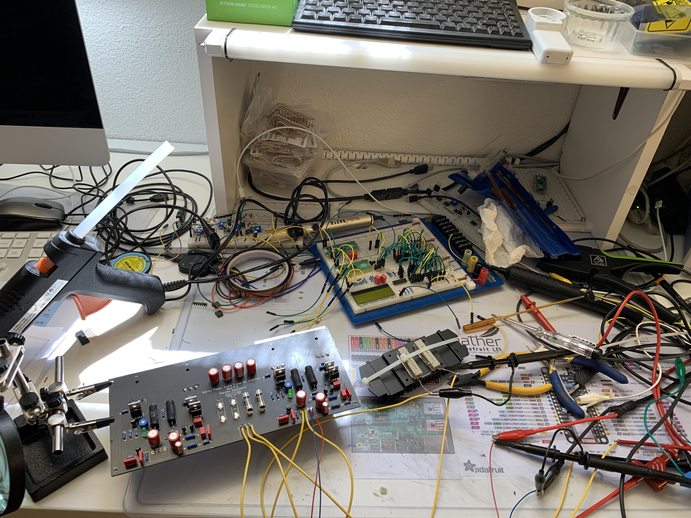
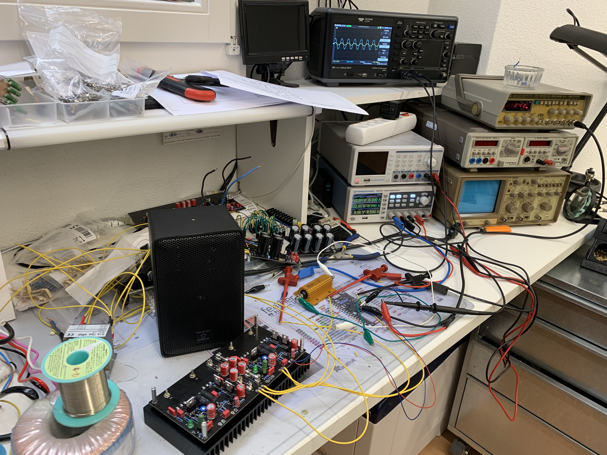
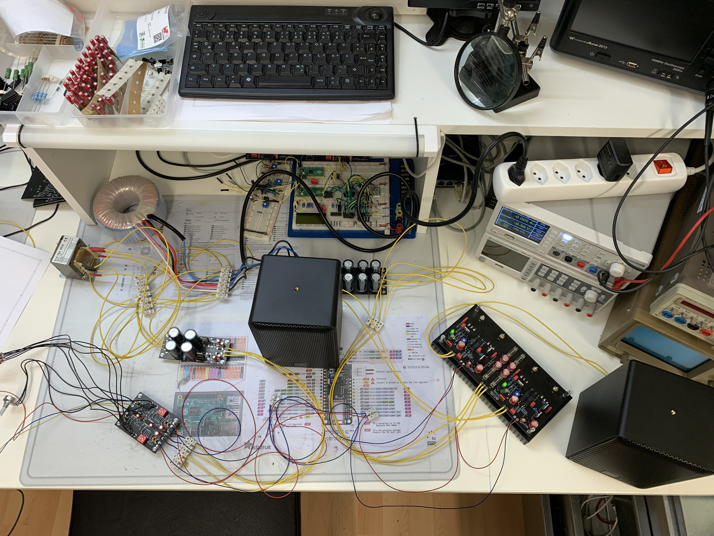
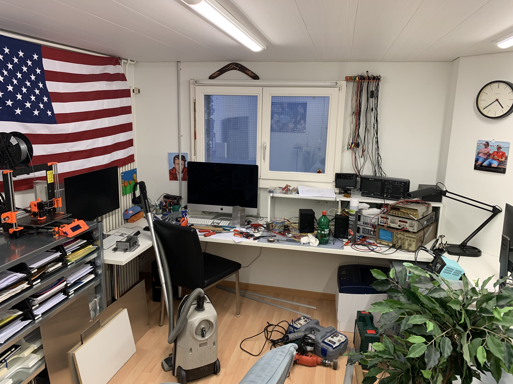
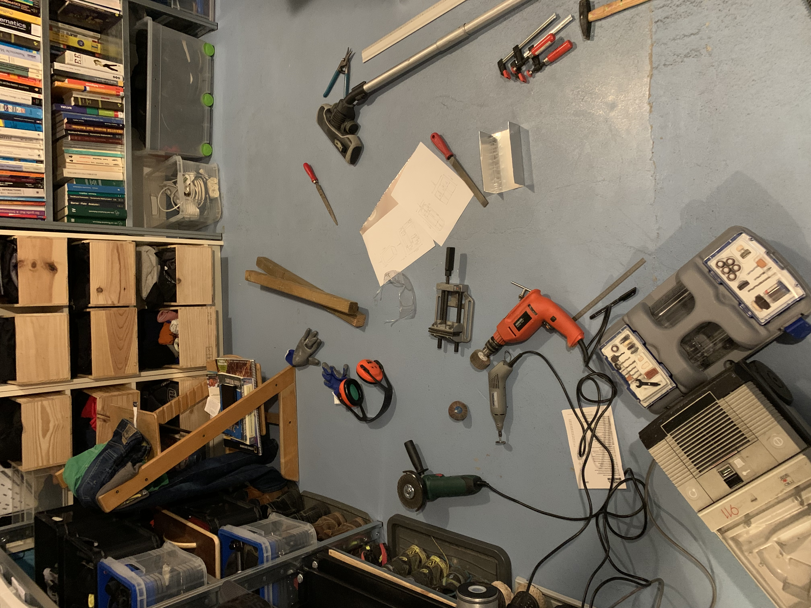
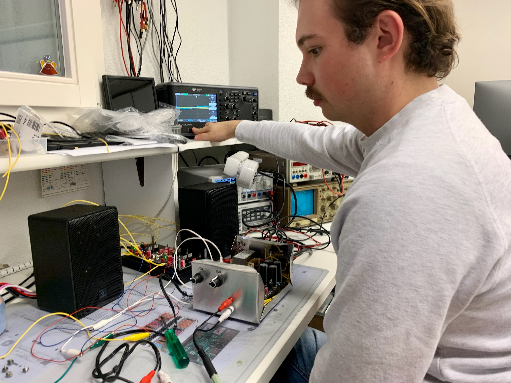
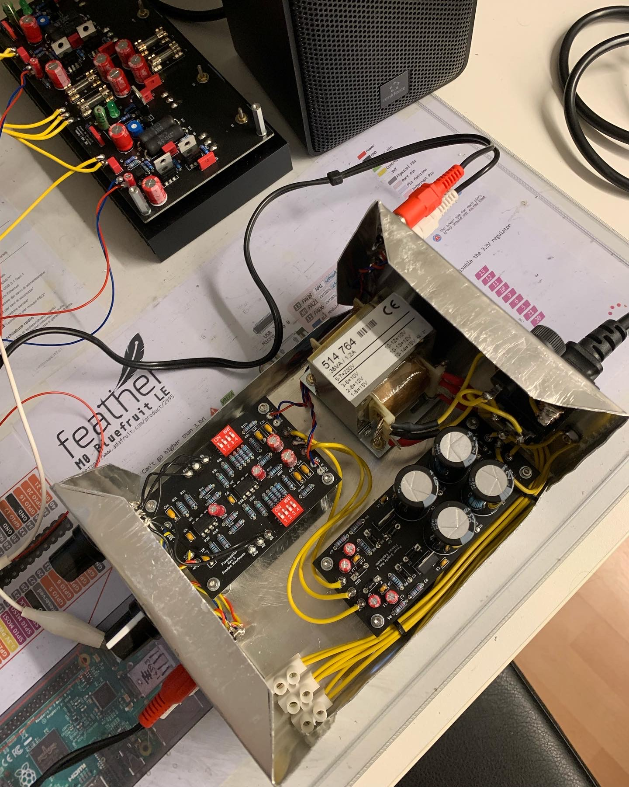

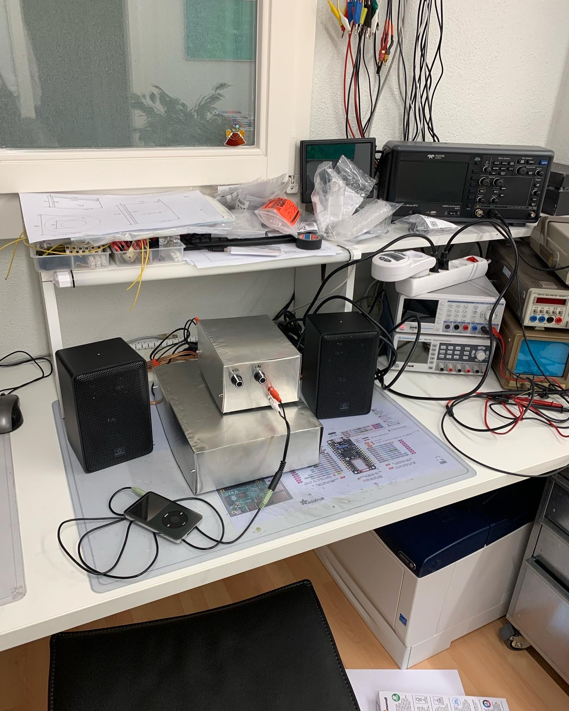
